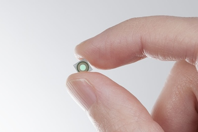
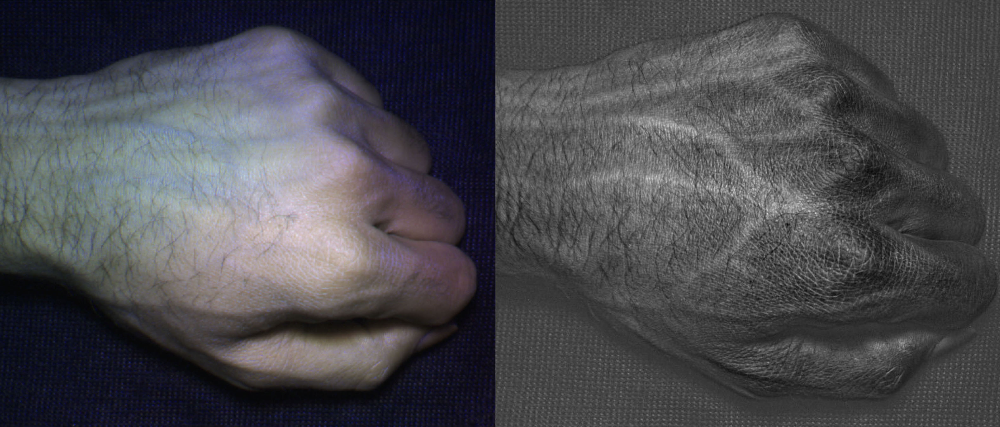
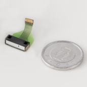
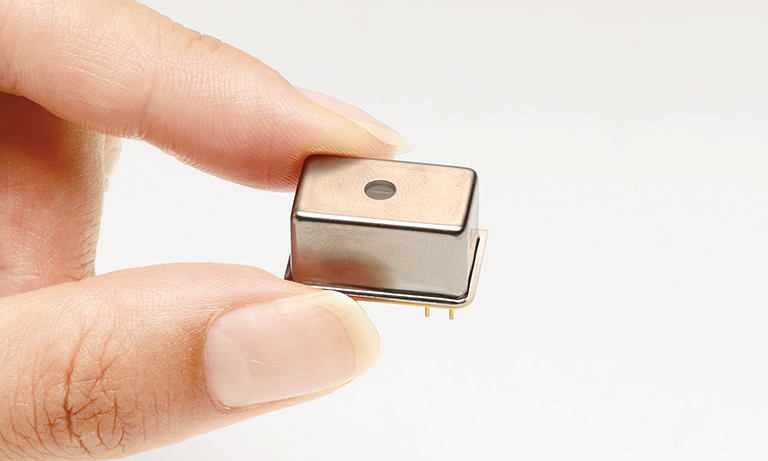

高光谱光谱仪和成像仪的微型化是遥感走向大众应用的关键硬件技术，传统的地物光谱仪和高光谱成像仪体型大，耗电量高，需要丰富的专业知识才能操作设备并对采集的数据进行分析和理解。随着制造工艺的发展，高光谱光谱仪和成像仪小型化也逐渐成为现实，并且开始出现相应的公司和商品。本文汇总了搜集到的几款典型的小型高光谱设备，希望借此来描述目前小型化高光谱设备的最新发展状态。

<!-- more -->

首先介绍一个小知识，就是普通手机摄像头使用的CCD/CMOS相机能够有效探测的光谱范围是超过人眼可见光谱范围的，一般来说人眼的可见范围在400-700nm左右，而CCD/CMOS传感器探测范围则可以达到400-1000nm左右，这也是很多高光谱相机在400-1000nm波段使用CMOS传感器的原因。同时相机传感器测量的是所有波段总辐亮度，因此如果想要获取不同谱段的辐亮度信息，需要在镜头前加装分光装置，通常为滤光片或者狭缝干涉分光，将进入特定CMOS传感器的光线只集中于某一个小的谱段范围内，从而实现高光谱成像。对于普通可见光相机来说，700-1000nm谱段的的信息是不需要的，如果让他们进入传感器，反而会影响成像效果，因此普通可见光相机都会增加一层红外滤光片，保证进入相机的光线在400-700nm范围内。这这使得相机的镜头仅靠外部加装新的滤光片也无法获得可将光范围外的光谱信息，除非增加新的镜头和传感器，或者手机镜头本身是经过特殊定制的才能使得手机具备近红外成像能力。

## 1. 长虹H2

2017年1月6日，长虹在CES 2017发布了长虹H2手机，号称“世界首款分子识别手机”， 集成了亚德诺半导体技术有限公司（ADI）及以色列Consumer Physics公司共同合作研发高光谱传感器[^1]。其传感器是Consumer Physics开发的手持光谱仪“SCiO”。从公开资料上来看，该设备为获取目标单点光谱信息，然后通过云端算法比对，返回目标光谱信息，没有找到该设备相应光谱范围信息，但是其嵌入式设备的基本信息显示测量距离从接触到2cm，测量时间2-5s，除了手机芯片外，该公司还提供小型的手持光谱仪（汽车钥匙大小），功能类似。公司宣称使用该设备能够实现的功能包括[^2]：

 - 果蔬检测：糖分、水分、品质
 - 体脂率、热量平衡检测
 - 烟草产地、品种检测
 - 药品真伪检测
 - 皮肤保健：水分、油脂、年龄
 - 酒类检测：工艺、原料、品质
 - 牛奶过期、饮料糖分或酒精含量

## 2. SPECIM IQ

宣称为世界上首个手持移动高光谱成像仪（2017-12-1），机尺寸207mm × 91mm，约为单反相机大小，具体技术参数为[^3]:

| **Spectral camera**          | VNIR 400-1000 nm (CMOS)                             |
| :--------------------------- | :-------------------------------------------------- |
| **Viewfinder camera**        | 5 Mpix                                              |
| **User interface SW**        | By Specim                                           |
| **Storage**                  | SD card max 32 GB                                   |
| **Data Format**              | Specim Dataset with ENVI compatible data files      |
| **Battery**                  | 5200 mAh Li-Ion (Type 26650)                        |
| **Operational time**         | Appx. 100 measurements with one SD card and battery |
| **Display & keyboard**       | 4.3 ” touch screen + 13 physical buttons            |
| **Camera interface**         | USB Type-C                                          |
| **Size**                     | 207 x 91 x 74 mm (depth with lens 125,5 mm)         |
| **Weight**                   | 1.3 kg                                              |
| **F/number**                 | 1.7                                                 |
| **Wavelength band**          | 400-1000 nm                                         |
| **Spectral resolution FWHM** | 7 nm                                                |
| **Spatial Sampling**         | 512 pix                                             |
| **Spectral bands**           | 204                                                 |
| **Peak SNR**                 | > 400:1                                             |
| **Object distance**          | 150 – ∞ mm                                          |
| **FOV**                      | 31 x 31 deg                                         |
| **FOV at 1 m**               | 0.55 x 0.55 m                                       |
| **Temperature, operational** | +5°C – +40°C                                        |
| **Humidity, operational**    | 95% non-condensing                                  |

- 相机正面

- 相机背面

同时已经有文章[^4]来测试该相机性能并讨论该相机在植物表型分析和疾病探测方面的引用。

## 3. 芬兰VTT实现的MEMS-FPI改造的iPhone 5s超光谱成像系统

芬兰的VTT国家技术研究中心（VTT Technical Research Centre of Finland）在iPhone相机中整合了电性可调微光学机电系统（MEMS， Micro Opto Electro Mechanical Systems），该系统是一种法布立-培若干涉仪(Fabry-Perot Interferometer；FPI)，其原理是将金属电极整合至反射镜薄膜，使其达到可由电容制动器调谐气缝的高度，从而改变带通波长[^5]。即可以通过电压控制通过滤波器的光线的谱段范围，从而实现获取特定谱段图像的目的。这种方法与通过滤光片获取高光谱图像原理类似，同时也有相同的缺点，即同一时间只能获取某一个谱段的图像。

- *Fabry-Pérot interferometer tunable optical filter↓*

- *使用高光谱图像获取静脉血管图像↓*

到目前为止，VTT的微型高光谱滤波产品有两条产品线，一条是VNIR波段产品（400-1000nm），其产品系列如下[^7]：

| Image                                                        | Part No.                                                     | Product Name                 | Type                                      | Spectral Response Range | Spectral Resolution (FWHM) |
| ------------------------------------------------------------ | ------------------------------------------------------------ | ---------------------------- | ----------------------------------------- | ----------------------- | -------------------------- |
|  | [C14384MA-01](https://www.hamamatsu.com/us/en/product/type/C14384MA-01/index.html) | Mini-spectrometer SMD series | Spectrometer head High sensitivity type   | 640 to 1050nm           | 25nm                       |
|  | [C10988MA-01](https://www.hamamatsu.com/us/en/product/type/C10988MA-01/index.html) | Mini-spectrometer MS series  | Spectrometer head                         | 340 to 750nm            | 14 nm                      |
|  | [C11708MA](https://www.hamamatsu.com/us/en/product/type/C11708MA/index.html) | Mini-spectrometer MS series  | Spectrometer head For near IR             | 640 to 1050nm           | 20 nm                      |
|  | [C12666MA](https://www.hamamatsu.com/us/en/product/type/C12666MA/index.html) | Micro-spectrometer           | Spectrometer head Wide dynamic range type | 340 to 780nm            | 15 nm                      |
|  | [C12880MA](https://www.hamamatsu.com/us/en/product/type/C12880MA/index.html) | Micro-spectrometer           | Spectrometer head High sensitivity type   | 340 to 850nm            | 15 nm                      |

VNIR产品图示：

另外一条产品线是SWIR的光谱传感器，其产品序列如下表所示[^8]：

| Image                                                        | Part No.                                                     | Product Name             | 光谱相应区间    | 光谱分辨率（FWHM） | 最大暗电流 | 传感器成像敏感区域 |
| ------------------------------------------------------------ | ------------------------------------------------------------ | ------------------------ | --------------- | ------------------ | ---------- | ------------------ |
|  | [C14273](https://www.hamamatsu.com/us/en/product/type/C14273/index.html) | MEMS-FPI spectrum sensor | 1750 to 2150 nm | 22 nm              | 150 nA     | φ0.3 mm            |
|  | [C13272-02](https://www.hamamatsu.com/us/en/product/type/C13272-02/index.html) | MEMS-FPI spectrum sensor | 1550 to 1850 nm | 20 nm              | 40 nA      | φ0.1 mm            |
|  | [C14272](https://www.hamamatsu.com/us/en/product/type/C14272/index.html) | MEMS-FPI spectrum sensor | 1350 to 1650 nm | 18 nm              | 10 nA      | φ0.3 mm            |

## 参考文献

[^1]: [长虹H2智能手机，世界首款分子识别手机 | CES 2017](https://cn.technode.com/post/2017-01-09/changhong-h2/) 
[^2]: [Customized solutions with the SCiO pocket-sized NIR spectrometer](https://www.consumerphysics.com/business/solutions/)
[^3]: [Specim IQ Technical Specifications](http://www.specim.fi/iq/tech-specs/)
[^4]: [Behmann, J.; Acebron, K.; Emin, D.; Bennertz, S.; Matsubara, S.; Thomas, S.; Bohnenkamp, D.; Kuska, M.T.; Jussila, J.; Salo, H.; Mahlein, A.-K.; Rascher, U. Specim IQ: Evaluation of a New, Miniaturized Handheld Hyperspectral Camera and Its Application for Plant Phenotyping and Disease Detection. Sensors 2018, 18, 441.](https://www.mdpi.com/1424-8220/18/2/441)
[^5]: [iPhone变身首款全整合型的超光谱相机](https://www.eet-china.com/news/201612011017.html)
[^6]: [Anna Rissanen, Heikki Saari, Kari Rainio, Ingmar Stuns, Kai Viherkanto, Christer Holmlund, Ismo Näkki, Harri Ojanen, "MEMS FPI-based smartphone hyperspectral imager," Proc. SPIE 9855, Next-Generation Spectroscopic Technologies IX, 985507 (12 May 2016)](https://www.spiedigitallibrary.org/conference-proceedings-of-spie/9855/985507/MEMS-FPI-based-smartphone-hyperspectral-imager/10.1117/12.2229575.short?SSO=1)
[^7]: [Micro-spectrometers](https://www.hamamatsu.com/us/en/product/optical-sensors/spectrum-sensor/micro-spectrometer/index.html)
[^8]: [MEMS-FPI spectrum sensors](https://www.hamamatsu.com/us/en/product/optical-sensors/spectrum-sensor/mems-fpi-spectrum-sensor/index.html)